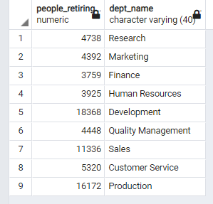

# Pewlett_Hackard_Analysis

## Project Overview
Pwelett Hackard is a large company with thousands of employees. As the older generation begins retiring at a rapid rate, management needs to look to the future of the company and minimize the potential damage from the "silver tsunami" on the workforce. 

### Resources:
  -  Data: 6 csv's (departments, employees, dept_emp, dept_managers, titles, salaries), other csv's are tables created from my queries.
  -  Software: PostgresSQL 13,
      -  SQL files for reference of my queries

## Summary 
The data includes: 
  - Past and current employee names, birthdates, hire dates, their salaries, titles, and departments worked in. 
  - Employees born in 1952 to 1955 are anticipated to be retiring this year or next year.
#### Count of Employees retiring and the impact across the company
 

  - Oldest employee was born in 1952 and the youngest: 1965. Assuming the 'employees.csv' is a complete list of employess, then the entire workforce will be retired in 15 years or less and the company is facing a much larger problem than anticipated. 

## Results  
### In the next 15 years there will be 3 "Silver" Tsunami's
  
- "now" is the current wave of retires.
- "n5" is the wave that starts in 5 years.
- "n10" is the wave that starts in 10 years.
-  Minimizing these tsunami impacts will be important for the company's survival.
-  Instead of having all of the retiries leave at once, take the best, most experienced and successful employees about to retire and have them mentor new hires part time.
- Initially as the program starts, those eligible to be mentors are born in 1965. It will take time to get this program going, which is why those from this current wave of retires were not chosen to be eligible.

### Mentors vs The First Retiring Wave

- There number of eligible mentors is lower than anticipated, each mentor would have to have 10 new hires trained every month to be back at regular workforce in a couple years, only to be hit by the second "Silver" Tsunami. 
  - 10 people trained per month is full time work, not part-time. 
  - the mentorship program needs to be 3 months, not 1 month.
  - these numbers are not acceptable for the mentorship program.  

Changing the eligibility requirments for the mentor program from those born only in 1965, or earlier, to the top 20% of the 2nd and 3rd silver tsunamis provides much better numbers (columns: n5 & n10 from the table that show all 3 tsunamis and their effect on the company's workforce).

- The retiring column in this table is everyone in the first and second waves expected to retire. If the mentorship program starts later this year, the impact of all three can be minimized.

- It is recommended for the mentorship program moving forward after the third wave, eligable to employees will be those in the top 20% of those that can retire within 8 years and mentoring contract lasts a minimum of 5 years.

## Notes:
- The queries.sql file is some basic queries exploring the data. 
- The Employee_Database_Challenge.sql file is the queries to identify eligible employees for the Mentorship Program.
- mentorship_eligibility.csv file is the list of eligible employees based on the intitial requirement of being born in 1965, not the extra recommendations I have made.

